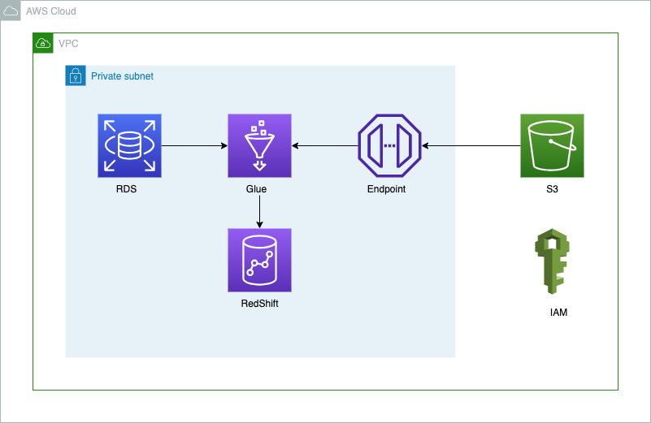
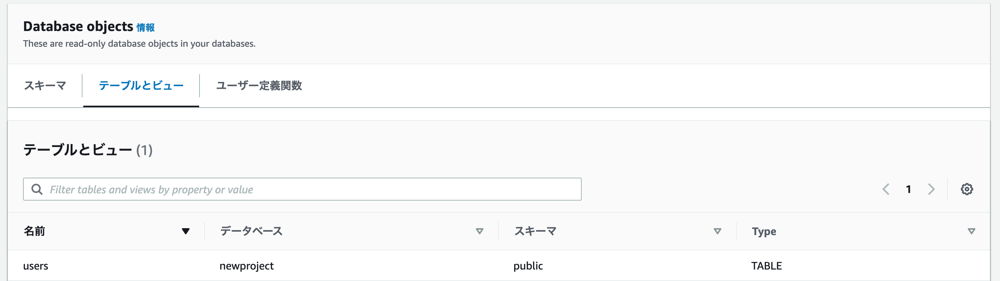

# データ分析基盤構築：Terraformを用いたRDS、Glue、Redshiftによるデータ移行

<p align="center">
  
</p>


# 概要
本リポジトリは、Terraformを用いてAWS上でデータ分析基盤を構築し、RDSからRedshiftへデータを移行するための手順をまとめたものです。

# 目的
1. AWS上のデータ分析基盤を自動構築し、インフラ管理の効率化を実現
2. RDSからRedshiftへのデータ移行を自動化し、データ分析を迅速化

# アーキテクチャ
本基盤は、以下のコンポーネントで構成されています。
+ RDS: データソースとして、MySQL、PostgreSQLなどのデータベースをホストします。
+ Glue: データ変換とデータロードのためのサーバーレスサービスです。
+ Redshift: データウェアハウスとして、大量データを効率的に処理します。

# 機能一覧
+ Terraformを用いたRDS、Glue、Redshiftの自動構築
+ Glueジョブを用いたRDSからRedshiftへのデータ移行
+ データ移行状況のモニタリング

# 起動とデプロイ方法
1. 以下のコードを実行し、sshkeyを作成
```
bin/make_sshkey
```

2. 以下のコードを実行すると実行
```
bin/terraform_apply
```

3. Glueのジョブを実行
    1. AWS Management Consoleにログインし、Glueコンソールを開きます。
    2. 左側のメニューから「ジョブ」を選択します。
    3. 実行したいジョブをクリックします。
    4. ジョブの詳細画面で、「実行」ボタンをクリックします。
    5. 「実行」をクリックしてジョブを実行します。

# 停止方法
以下のコードを実行すると実行されます。
```
bin/terraform_destroy
```

# 結果

以下のようにredshiftにtableを作られました。

<p align="center">
  
</p>


