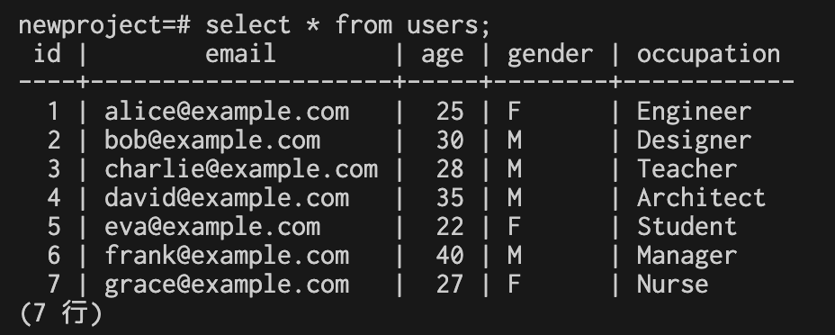

# データ分析基盤構築：Terraformを用いたRDS、Glue、Redshiftによるデータ移行

<p align="center">
  
</p>


# 概要
本リポジトリは、Terraformを用いてAWS上でデータ分析基盤を構築し、RDSからRedshiftへデータを移行するための手順をまとめたものです。

# 目的
1. AWS上のデータ分析基盤を自動構築し、インフラ管理の効率化を実現
2. RDSからRedshiftへのデータ移行を自動化し、データ分析を迅速化

# アーキテクチャ
本基盤は、以下のコンポーネントで構成されています。
+ RDS: データソースとして、MySQLのデータベースをホストします。
+ Glue: データ変換とデータロードのためのサーバーレスサービスです。
+ Redshift: データウェアハウスとして、大量データを効率的に処理します。

# 機能一覧
+ Terraformを用いたRDS、Glue、Redshiftの自動構築
+ Glueジョブを用いたRDSからRedshiftへのデータ移行
+ データ移行状況のモニタリング

# 起動とデプロイ方法
1. 以下のコードを実行し、sshkeyを作成
```
bin/make_sshkey
```

2. 以下のコードを実行すると実行
```
bin/terraform_apply
```

3. Glueのジョブを実行
  1. AWS Management Consoleにログイン
  2. Glueサービスに移動
  3. 実行したいジョブを選択し、[Run Job]ボタンをクリック

# 停止方法
以下のコードを実行すると実行されます。
```
bin/terraform_destroy
```

# 結果

## EC2にSSH接続し、MySQLのusersテーブルを確認

まず、EC2インスタンスにSSHで接続します。

```
cd infra/modules/ec2/src
ssh -i "todolist-keypair.pem" ec2-user@ec2-xxxxxxxxx.ap-northeast-1.compute.amazonaws.com
```

次に、MySQLデータベースに接続します。

```
mysql -h source-db.xxxxxxxxx.ap-northeast-1.rds.amazonaws.com -u admindbuser -pMysql1aaaaA newproject
```

最後に、usersテーブルの内容を確認します。

```
select * from users;
```

<p align="center">
  
</p>


## Glueのジョブを実行する

AWS Glueのジョブを実行するには、以下の手順に従ってください。

  1. AWS Management Consoleにログイン
  2. Glueサービスに移動
  3. 実行したいジョブを選択し、[Run Job]ボタンをクリック

## EC2にSSH接続し、RedShiftのusersテーブルを確認

以下のようにredshiftにtableを作られました。

<p align="center">
  
</p>

まず、EC2インスタンスにSSHで接続します。


```
cd infra/modules/ec2/src
ssh -i "todolist-keypair.pem" ec2-user@ec2-xxxxxxxxx.ap-northeast-1.compute.amazonaws.com
```

次に、Redshiftクラスターに接続します。

```
psql -h main-redshift-cluster.xxxxxxxxx.ap-northeast-1.redshift.amazonaws.com -U admindbuser -d newproject -p 5439
```

最後に、usersテーブルの内容を確認します。

```
select * from users;
```

<p align="center">
  
</p>

これらの手順を実行することで、EC2インスタンスからMySQLおよびRedshiftデータベースのusersテーブルにアクセスし、内容を確認することができます。AWS Glueのジョブも簡単に実行することができます。

## Qiita記事

技術詳細はQiitaに記載しています。

[データ分析基盤構築：Terraformを用いたRDS、Glue、Redshiftによるデータ移行](https://qiita.com/sugiyama404/items/3035ebc9d0fda89a0761)


